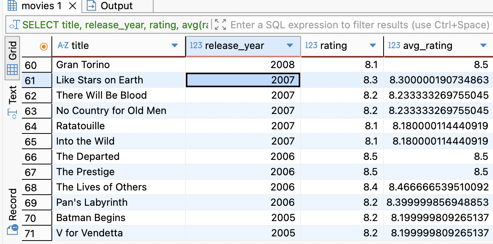

## Project 3: Window Function
#### 1. In database-covid19, build a view date difference shows the date difference between accumulative_cases and calendars, which means that the result shows dates that shows in calenders but do not shows in accumulative_cases.

- Join the two tables, using left join (left is calender)
- select the null

##### Solution1 : Use Window Function

```sql
WITH date_difference AS (
SELECT calendars.recorded_on,
       accumulative_cases.id
FROM calendars
LEFT JOIN accumulative_cases ON calendars.id = accumulative_cases.calendar_id
WHERE accumulative_cases.id IS NULL
)
SELECT recorded_on
FROM date_difference
GROUP BY recorded_on;
```

##### Solution2 : Except (A有B沒有)

```sql
-- calendar有的id但accumulative_cases沒有的id
SELECT id
FROM covid19.calendars
EXCEPT
SELECT DISTINCT calendar_id
FROM covid19.accumulative_cases;

-- 接著做子查詢

SELECT id,
       recorded_on
FROM calendars
WHERE id IN (SELECT id
FROM covid19.calendars
EXCEPT
SELECT DISTINCT calendar_id
FROM covid19.accumulative_cases);

-- 打包進檢視表

CREATE VIEW covid19.date_difference
AS (
SELECT id,
       recorded_on
FROM calendars
WHERE id IN (SELECT id
FROM covid19.calendars
EXCEPT
SELECT DISTINCT calendar_id
FROM covid19.accumulative_cases)
);

-- 查看view結果
SELECT * FROM covid19.date_difference;
```

#### 3. Build a view from covid19 database. Create a view named most_populated_province that shows the most populated province (or state) for each country from the locations table. The view should only include countries with data broken down by province (or state).
建立一個檢視表 most_populated_province 顯示 locations 資料表每個國家人口數最多的州別（或省份），沒有切分州別（或省份）資料的國家不需要包含在該檢視表中。

- 找每個國家人口數最多的省份。注意，這邊原始資料的NULL存成string所以才沒有用is not null去設定



```sql
SELECT country_name,
       province_name,
       population
FROM covid19.locations
WHERE province_name != 'NULL'
ORDER BY country_name ASC;
```
- 現在要找出每個國家的第一筆資料，也就是挑出每個國家人口數最多的省份
- ->使用FIRST_VALUE

```sql
CREATE VIEW most_populated_province AS (
SELECT DISTINCT country_name,
       FIRST_VALUE(province_name) OVER (PARTITION BY country_name ORDER BY population DESC) AS most_populated_province_name
FROM covid19.locations
WHERE province_name != 'NULL');

SELECT * FROM most_populated_province;
```
#### 4. Create a view named daily_cases that shows the number of new daily cases for each location_id and calendar_id
建立一個檢視表 daily_cases 顯示每個 location_id、calendar_id 的每日新增個案數。

- 目前在confirmed和death都是累加數字，因此要用目前數字-後一天數字才會是每日數據差 
- lag()

```sql
SELECT calendar_id,
       location_id,
       confirmed - LAG(confirmed) OVER (PARTITION BY location_id ORDER BY calendar_id) AS confirmed,
       deaths - LAG(deaths) OVER (PARTITION BY location_id ORDER BY calendar_id) AS deaths
FROM accumulative_cases;
```

- 建立檢視表

```sql
CREATE VIEW daily_cases AS (
SELECT calendar_id,
       location_id,
       confirmed - LAG(confirmed) OVER (PARTITION BY location_id ORDER BY calendar_id) AS confirmed,
       deaths - LAG(deaths) OVER (PARTITION BY location_id ORDER BY calendar_id) AS deaths
FROM accumulative_cases);


SELECT * FROM daily_cases;
```


